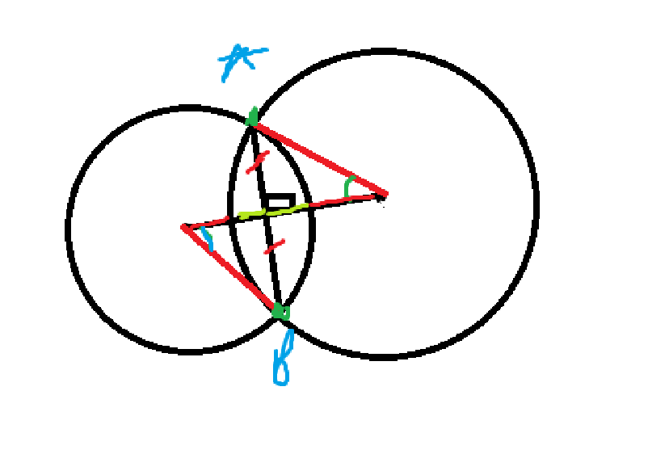

## Mục lục

1. [Bài 1](#bài-1-đoạn-con-có-ucln-lớn-nhất)
2. [Bài 2](#bài-2-số-nguyên-tố-có-tổng-n)
3. [Bài 3](#bài-3-tổng-nhỏ-nhất-2-phần-tử-2-mảng)
4. [Bài 4](#bài-4-cặp-nghịch-thế)
5. [Bài 5](#bài-5)
6. [Bài 6](#bài-6-sắp-xếp-tăng-dần)
7. [Bài 7](#bài-7-ướt-mưa)
8. [Bài 8](#bài-8-đặt-hậu)
9. [Bài 9](#bài-9)
10. [Bài 10](#bài-10)
11. [Bài 11](#bài-11)
12. [Bài 12](#bài-12-vẽ-hình-vuông)
13. [Bài 13](#bài-13-sửa-trên-lớp-rồi-nè)
14. [Bài 14](#bài-14-đường-chéo-linh-thiêng)
15. [Bài 15](#bài-15-hình-tròn-giao-nhau)
16. [Bài 16](#bài-16)
17. [Bài 17](#bài-17)
18. [Bài 18](#bài-18-đảo-dãy)

## Bài 1: Đoạn con có UCLN lớn nhất

### Tóm tắt:

- Tìm đoạn con đúng k phần tử liên tiếp sao cho UCLN của chúng là MAX.

### Hướng giải:

1. Các cấu trúc dữ liệu để tính dãy con liên tiếp. (Segment Tree/ Fenwick Tree/ Sparse Table)

- Độ phức tạp: O(nlogn)

### Mở rộng:

1. Nếu có cập nhật 1 phần tử trong mảng.

- Sử dụng Segment Tree/ Fenwick Tree để cập nhật.

2. Có Q truy vấn, mỗi truy vấn cho mỗi K khác nhau.

- Nếu truy vấn nhiều thì có thể sử dụng RMQ (Range Minimum Query) để giảm độ phức tạp.

## Bài 2: Số nguyên tố có tổng N

### Tóm tắt:

- $g(n)$ là số lượng cặp $(p,\ q)$ khác nhau thõa:

  - $p,\ q$ là số nguyên tố.
  - $p + q = 2 \times n$.

- $f(n) = g(2) + g(3) + ... + g(n)$

- Tìm $f(n)$.

### Nhận xét đề:

- Tại sao $p,\ q$ phải là số nguyên tố?

- Liệu $g(i)$ có thể cập nhật từ $g(j)$ với $j < i$?

- Liệu có cách nào khai triển $f(n)$ để không phụ thuộc vào $g(i)$ không?

- Các giá trị mẫu:

| $n$ | $g$ | $f$ | Chú thích     |
| --- | --- | --- | ------------- |
| 2   | 1   | 1   | (2, 2)        |
| 3   | 1   | 2   | (3, 3)        |
| 4   | 1   | 3   | (3, 5)        |
| 5   | 2   | 5   | (3, 7), (5,5) |

### Nhận xét:

- Không mất tính tổng quát thì ta mặc định:

  - $p \leq q$.

  - $p \leq \dfrac{n}{2}$.

  - $q \geq \dfrac{n}{2}$.

### Hướng giải

#### Cách 1:

- Sàng nguyên tố theo $n$.
- Với mỗi giá trị $i$:
  - Tính $g(i)$.
  - Duyệt $p: 1 \Rightarrow i$ và kiểm tra $q$.

Độ phức tạp: $O(n^2)$

#### Cách 2:

```
Liệu có cách nào khai triển $f(n)$ để không phụ thuộc vào $g(i)$ không?
```

Phát biểu lại yêu cầu bài toán:

- Cho 1 số $N$.
- Hỏi: Có bao nhiêu cặp số $(p,\ q)$ thỏa mãn:
  - $p,\ q$ là số nguyên tố.
  - $p + q$ là số chẵn.
  - $p + q \leq 2 \times N$.

Cách làm:

1. Sàng nguyên tố
2. Chạy $q$ từ $1 \Rightarrow N$ và đếm xem có bao nhiêu $q$ thõa yêu cầu.
   - Tìm kiếm nhị phân.

Độ phức tạp: $O(nlogn)$

#### Cách 3: Liệu có cách nào có độ phức tạp O(n) không?

### Mở rộng:

1. Nếu $p, q$ không cần là nguyên tố thì sao?
2. Nếu $n$ đủ lớn?

## Bài 3: Tổng nhỏ nhất 2 phần tử 2 mảng

### Tóm tắt

- Tìm 2 phần tử trong 2 mảng A và B. Sao cho: $|a_i + b_j|$ là MIN.

### Nhận xét đề

### Hướng giải

### Mở rộng

0. $|a_i - b_j|$ là MIN.
1. $|a_i + b_j|$ là MAX.
2. Các phần tử được cập nhật giá trị.

## Bài 4: Cặp nghịch thế

### Tóm tắt:

- Tính số cặp nghịch thế

### Nhận xét:

- Với mỗi phần tử, cần tính xem có bao nhiêu số nhỏ hơn nó mà đứng sau nó. Ta thấy sẽ có 2 vấn đề trong bài toán này:

  1. Làm sao mình biêt số nào nhỏ hơn nó mà đứng đằng sau nó?
  2. Làm sao để tính số lượng số đứng đằng sau nó?

- Liệu có phân rã được 2 điều kiện này ra không?
  > Trick suy nghĩ là: Thay vì giải quyết toàn bộ ràng buộc thì tách ra xem coi các ràng buộc đó có thể giải quyết riêng được không?

1. Làm sao mình biết số nào nhỏ hơn nó mà đứng đằng sau nó?

- Ta có thể xét các phần tử theo thứ tự tăng dần.
- Như vậy, các phần tử nào **được xét trước** nó sẽ là nhỏ hơn hoặc bằng nó.
- Ta có thể biết được các vị trí của các phần tử được xét trước nó.

2. Làm thế nào để đếm được có bao nhiêu vị trí đã được xét tới mà đứng đằng sau vị trí của thằng đang xét?

- Tổng của các phần tử liên tiếp

### Hướng giải:

- BIT, Segment Tree.
- ĐỘ phức tạp: $O(nlogn)$

Lưu ý: $A[i]$ có thể âm, bằng nhau.

## Bài 5:

### Tóm tắt

- Tìm các vị trí mà xâu $B$ xuất hiện trong xâu $A$.

### Hướng giải

- Các thuật toán liên quan tới so khớp chuỗi:

  - KMP
  - Rabin-Karp: So sánh Hash
  - Z-Function
  - [Aho-Corasick](https://cp-algorithms.com/string/aho_corasick.html#toc-tgt-3): So khớp với nhiều mẫu. (Không cần thiết)
    - Trie + Suffix Link

- Độ phức tạp: $O(n + m)$

### Mở rộng

- Có $M$ mẫu.
  - Có thể gối đầu lên nhau: (a, ab, abc)
  - Không gối đầu lên nhau
- Hỏi có bao nhiêu mẫu xuất hiện trong $A$ và cho biết vị trí của chúng.

## Bài 6: Sắp xếp tăng dần

### Tóm tắt

- K dãy đã được sắp xếp tăng dần.
- Gộp K dãy lại thành 1 dãy tăng dần.

### Nhận xét đề

Có thể chia thành 2 bài toán con:

1. Cho biết các giá trị nhỏ nhất của mỗi dãy. Hỏi giá trị nhỏ nhất trong các giá trị đó là bao nhiêu? Ở dãy nào?
2. Giá trị tiếp theo trong dãy có giá trị nhỏ nhất đó là bao nhiêu?

**Gợi ý của đề**:

- Các dãy đã được sắp xếp tăng dần.
- Kích thước của mỗi dãy không quá $500$.

### Hướng giải

#### Cách 1: $O(nlogn)$

Sử dụng các CTDL để quản lý giá trị Min, Max như: Heap, Segment Tree, Fenwick Tree.

Độ phức tạp: $O(nlogn)$.

- $n$ là số lượng phần tử của dãy.

**Tuy nhiên**: Với độ phức tạp này thì ta hoàn toàn có thể gộp thành 1 dãy và Sort trên đó. (Độ phức tạp: $O(nlogn)$). Như vậy, **cách làm này là chưa hợp lý**.

#### Cách 2: Counting Sort $O(n)$

1. Counting Sort. (Độ phức tạp: $O(n)$)

   - Chỉ sử dụng được nếu $A[i] \leq 10^6$

> Tuy nhiên, vẫn chưa tận dụng được các thông tin của đề.

#### Cách 3:

## Bài 7: Ướt mưa

### Tóm tắt

- Mảng đất có độ cao được cho trong mảng $A[i]$.
- Tính lượng nước được đọng lại.

### Nhận xét đề

- Lượng nước động lại ở 1 vị trí là gì?

  > Lượng nước đọng lại ở 1 vị trí là độ cao của vị trí đó so với độ cao của 2 vị trí cao nhất bên trái và bên phải.

- Làm sao để tính nhanh 2 vị trí cao nhất bên trái và bên phải?
  > Sử dụng Segment Tree/ Fenwick Tree để lưu trữ các giá trị cao nhất ???
  > Sử dụng Stack để lưu trữ các giá trị cao nhất ???

### Hướng giải

- Sử dụng stack để lưu lại các vị trí cao nhất bên trái và bên phải.
- Độ phức tạp: $O(n)$

## Bài 8: Đặt hậu

### Tóm tắt

- Cho bàn cờ $N \times N$.
- Đặt $N$ quân hậu sao cho không có 2 quân hậu nào ăn được nhau.

### Nhận xét đề

1. Chỉ xuất ra 1 cách đặt thõa mãn $\Rightarrow$ Có thể sử dụng các Heuristic để giải quyết.

2. Cần phải backtracking để tìm ra vị trí đặt.

3. Làm sao để check nhanh việc các quân hậu có thể ăn nhau?

### Hướng giải

- Backtracking để tìm ra vị trí đặt.
- Heuristic để tìm ra vị trí đặt tốt nhất.

### Mở rộng

1. Tìm tất cả các cách đặt.
   - Không có điều kiện thêm.
   - Có vật cản trên bản đồ.

## Bài 9:

### Tóm tắt

- Cho 2 xâu $S$ và $T$.
- Xâu $T$ có thể chứa "." hoặc "\*".

  - "." thể hiện cho 1 kí tự bất kì.
  - "\*" thể hiện cho việc lặp lại 0 hoặc nhiều lần kí tự trước đó.

- Check xem có thể tạo $S$ từ $T$ hay không?

### Nhận xét đề

- Nếu không có "\*" thì sẽ làm như thế nào?
- Nếu có "\*" thì sẽ khó hơn như thế nào?

### Hướng giải

#### Cách 1: Quy hoạch động

Xây dựng mảng $F[i][j] = 0/1$ với ý nghĩa:

- $S[1 \rightarrow i]$
- $T[1 \rightarrow j]$
- Có cách nào để match với nhau hay không?

$F[i][j]$ có thể sử dụng lại kết quả từ các giá trị trước đó hay không? 3 trạng thái cơ bản:

1. $F[i - 1][j - 1]$

2. $F[i - 1][j]$

3. $F[i][j - 1]$

**Độ phức tạp**: $O(n^2)$

### Mở rộng

1. "\*" có thể thay thế cho bất kỳ chuỗi nào.

- [Link đề](https://leetcode.com/problems/wildcard-matching/description/)

## Bài 10:

### Tóm tắt

- Hình vuông lớn nhất gồm toàn số $0$ hoặc toàn số $1$.

### Nhận xét đề

Lưu ý: chỉ xuất độ dài cạnh của hình vuông.

- Làm sao để check nhanh 1 HCN có toàn số $0$ hoặc toàn số $1$?

  - Prefix Sum 2D.

- Làm sao từ 1 ô trong bảng, tìm được cạnh hình vuông lớn nhất có thể tạo ra?
  - Biết: Nếu có thể tạo được hình vuông cạnh là $X$. Thì chắc chắn có thể tạo được hình vuông cạnh là $X - 1$.
  - Sử dụng Binary Search để tìm cạnh hình vuông lớn nhất có thể tạo ra.

### Hướng giải

- Sử dụng Binary Search để tìm cạnh hình vuông lớn nhất có thể tạo ra.
  - Sử dụng Prefix Sum 2D để check nhanh 1 HCN có toàn số $0$ hoặc toàn số $1$.
- Độ phức tạp: $O(n^2logn)$

### Mở rộng

#### Hình chữ nhật có diện tích lớn nhất.

> Lúc này, ta không thể sử dụng Binary Search được nữa.

- Sử dụng Stack để tìm diện tích hình chữ nhật lớn nhất có thể tạo ra.
- Độ phức tạp: $O(n^2)$

Phân tích: (Không mất tính tổng quát, ta chỉ xét HCN toàn số 1)

- Xét theo từng hàng.

- Mỗi hàng, duy trì 1 mảng $h[i]$ là chiều cao của cột $a[row][i]$.

- Bài toán quay về là: Tìm HCN lớn nhất trong mảng $h[i]$.
  - Tìm $L[i]$ là vị trí đầu tiên mà $h[i]$ nhỏ hơn $h[i - 1]$.
  - Tìm $R[i]$ là vị trí cuối cùng mà $h[i]$ nhỏ hơn $h[i + 1]$.
  - Đoạn phủ của $L[i]$ và $R[i]$ là đoạn mà $h[i]$ là nhỏ nhất.

## Bài 11

[Link đề](https://codeforces.com/contest/730/problem/I)

### Tóm tắt

- Cho $K$ phần tử. Mỗi phần tử sẽ có 2 giá trị $a_i$ và $b_i$.

  - Nếu phần tử vào nhóm 1: Có giá trị là $a_i$.
  - Nếu phần tử vào nhóm 2: Có giá trị là $b_i$.

- Cần chia $K$ phần tử này vào 2 nhóm 1 và 2 sao cho:
  - Nhóm 1: $N$ phần tử
  - Nhóm 2: $M$ phần tử
  - Tổng giá trị là lớn nhất.

### Nhận xét đề

- Nếu chỉ xét $2$ phần tử, mỗi phần tử vào $1$ nhóm thì ta sẽ xếp như thế nào?
- Nếu chia hết $K$ phần tử vào 1 trong 2 nhóm, nhóm 1 có $N$ phần tử, nhóm 2 có $K - N$ phần tử thì tổng giá trị lớn nhất là bao nhiêu?
- Cần loại bỏ $K - N - M$ phần tử thì loại bỏ những phần tử nào?
- Giá trị $a_i$ với $b_i$ nhỏ thì có ứng dụng được gì không?

### Hướng giải

#### Cách 1: Quy hoạch động $O(N^3)$

$F[i][j][k]$ là: Tổng giá trị lớn nhất tạo được khi xét đến phần tử thứ $i$ và đã chọn $j$ phần tử vào nhóm 1 và $k$ phần tử vào nhóm 2.

- Độ phức tạp: $N^3$

#### Cách 2: Quy hoạch động $O(N^2)$

**Nhận xét (Quan trọng)**:

- Nếu ta đã chọn được 1 tập các phần tử thuộc vào nhóm 2 rồi.
- Thì các phần tử còn lại, ta chỉ cần sort giảm dần và lấy ra $N$ thằng đầu tiên.

Như vậy, khi ta sort dữ liệu theo sự giảm dần của $A_i$ thì chắc chắn:

- Nếu thằng thứ $i$ không vào nhóm $2$ thì chắc chắn sẽ vào nhóm $1$ nếu còn trống.

Trạng thái quy hoạch động:

- $F[i][j]$ là: Tổng giá trị lớn nhất tạo được khi xét đến phần tử thứ $i$ và đã chọn $j$ phần tử vào nhóm 2.
  - Lúc này, $i - j$ là số lượng phần tử đã vào nhóm $1$.
  - Nếu $i - j > N$ thì mình sẽ không cập nhật giá trị $A_i$ vào.

Độ phức tạp: $O(N^2)$

#### Cách 3: Tham lam - Priority Queue

Nhìn bài toán theo 1 góc nhìn khác:

- Cho $K$ phần tử.

  - Mỗi phần tử sẽ có sức mạnh bình thường là $b_i$.
  - Nếu được nâng cấp sức mạnh thì sẽ đạt được mức là : $a_i$. (Không đảm bảo $a_i > b_i$)

- Bạn được chọn ra $N + M$ phần tử trong tập hợp. Đồng thời buộc phải nâng cấp cho $N$ phần tử trong số đó. Hỏi: Tổng sức mạnh lớn nhất có thể đạt được là bao nhiêu?
  - Nếu nâng cấp thì mình sẽ được: $a_i - b_i$.

**Quy ước:**

- Nhóm $A$: Là nhóm các phần tử nhận giá trị $a_i$. ($N$ phần tử)
- Nhóm $B$: Là nhóm các phần tử nhận giá trị $b_i$. ($M$ phần tử)

**Nhận xét:**

- Ta sẽ chia ra làm 3 tập hợp:

  0. **Tập hợp 0**: Tập hợp các phần tử đã chọn vào nhóm $A$. (Chúng ta sẽ đi cập nhật tập hợp này.)
     - Gọi $T$ là số lượng phần tử của tập hợp.
     - Ban đầu thì $T = 0$.
     - Khi có phần tử được thêm vào thì $T+=1$
  1. **Tập hợp 1** (Ứng cử viên cho nhóm $B$): gồm $N + M - T$ phần tử có $b_i$ lớn nhất. Coi như mình chọn tất cả vào nhóm $B$. Sau đó mình sẽ lọc lại vào nhóm $A$ sau.
  2. **Tập hợp 2**: Tập các phần tử còn lại.

- Ta thấy, nếu ta muốn chọn các phần tử vào nhóm $B$ thì chỉ chọn trong tập hợp 1 thôi. (Vì tập có $b_i$ lớn nhất).
- Lúc này, tập thứ $2$ chỉ có thể là những ứng cử viên để tham gia vào nhóm $A$.

- Như vậy, công việc tiếp theo là làm sao để chọn ra các phần tử thuộc thuộc tập hợp $1$ và $2$ để đưa vào nhóm $A$ - hay là tập hợp 0.

**Giải**:

- Chuyện gì sẽ xảy ra khi đưa 1 phần tử từ tập hợp 1 sang nhóm $A$:

  - Ta chỉ cần quan tâm đến $a_i - b_i$.
    > Vậy, ứng cử viên nặng ký nhất trong tập hợp thứ $1$ sẽ là phần tử có $a_i - b_i$ **lớn nhất**.

- Chuyện gì nếu ta đưa 1 phần tử từ tập thứ $2$ sang nhóm $A$:

  - Ta chỉ cần quan tâm đến phần tử có $a_i$ càng lớn càng tốt.
    > Vậy ứng cử viên nặng ký nhất trong tập hợp thứ $2$ sẽ là phần tử có $a_i$ **lớn nhất**.

- Thế giờ nếu đã có 2 ứng cử viên của 2 tập rồi thì ta sẽ chọn ứng cử viên nào?

  - Gọi ứng cử viên của tập thứ $1$ là $X$ và tập thứ $2$ là $Y$.
  - Nếu $a_X - b_X > a_Y - min\_b\_value()$ thì ta sẽ chọn $X$.
    - $min\_b\_value()$ : Là giá trị $b_i$ nhỏ nhất trong tập hợp thứ $1$.
  - Ngược lại thì chọn $Y$.

- Nếu chọn $X$ thì ta sẽ đưa $X$ ra khỏi tập hợp thứ $1$.
- Nếu chọn $Y$ thì:

  1. Đưa $Y$ ra tập hợp thứ $2$.
  2. Pop giá trị có $b_i$ nhỏ nhất ra khỏi tập hợp thứ $1$. (Để duy trình tính đúng đắn của tập hợp $1$)
  3. Thêm phần tử mới pop ra vào tập hợp thứ $2$.

- Độ phức tạp: $O(NlogN)$

## Bài 12: Vẽ hình vuông

### Tóm tắt

- Vẽ hình vuông với tọa độ nguyên có diện tích bằng $S$.

### Nhận xét đề

- Ta chỉ cần tìm $a$, $b$ với: $a^2 + b^2 = S$ với $a, b$ là số nguyên.

### Hướng giải

- Với tọa độ: $(x_a, y_A)$ và 2 giá trị $(a, b)$ tìm được thì ta sẽ dễ dàng vẽ được hình vuông.
  > (xA, yA), (xA + a, yA + b), (xA -b + a, yA + a + b), (xA - b, yA + a)

### Mở rộng

1. Giới hạn MAX của bài này là bao nhiêu?
2. Đếm số lượng hình vuông có diện tích bằng $S$.

- Số lượng cặp $(a, b)$ thõa mãn $a^2 + b^2 = S$.
- Với mỗi cặp, vẽ được bao nhiêu hình.

## Bài 13 (Sửa trên lớp rồi nè)

### Tóm tắt

- Chọn điểm để chia tập hợp điểm ban đầu thành 2 phần bằng nhau.

### Hướng giải

- Với mỗi điểm thì luôn tìm được điểm còn lại thỏa bài toán.
- Sort theo góc.

### Mở rộng

## Bài 14: Đường chéo linh thiêng

### Tóm tắt

- Cho tập $N$ đỉnh trên bao lồi.
- Tìm đường chéo chia hình thành 2 phần có chênh lệch diện tích nhỏ nhất.

### Hướng giải

#### Cách 1: Trâu toàn phần

> Độ phức tạp: $O(N^3)$

1. Chạy $N^2$ đường chéo.
2. Với mỗi đường chéo duyệt qua tính diện tích từng phần. (Độ phức tạp: $O(N)$)
3. Lưu lại đường chéo có diện tích nhỏ nhất.

#### Cách 2: Trâu một phần - hơi dùng não

> Độ phức tạp: $O(N^2)$

1. Chạy $N^2$ đường chéo.
2. Với mỗi đường chéo duyệt qua tính diện tích từng phần. (Độ phức tạp: $O(1)$)
   - Làm sao để tận dụng lại được dữ liệu?
3. Lưu lại đường chéo có diện tích nhỏ nhất.

#### Cách 3: Dùng não hơi nhiều

> Độ phức tạp: $O(N)$

**Gợi ý**: 2 con trỏ

## Bài 15: Hình tròn giao nhau

### Tóm tắt

- Tìm diện tích giao nhau giữa 2 hình tròn

### Hướng giải

Tính diện tích giao nhau:

- Tính góc
- Tính diện tích cung tròn
- Tính diện tích tam giác

Chỉ cần tính được góc thì có thể suy ra $2$ diện tích còn lại.


Các tính chất có thể áp dụng:

1. Đường ngang đi qua trung điểm của đường dọc.
2. 2 đường vuông góc với nhau.
3. Nếu 2 bán kính bằn nhau thì đường dọc cũng đi qua trung điểm đường ngang luôn.

### Mở rộng

1. 2 bán kính không bằng nhau.

- Giải 2 phương trình 2 ẩn số để tìm độ dài của 2 cạnh màu xanh chuối chưa biết.
  - Dựa vào $R_1^2 - R_2^2$ và tổng độ dài 2 cạnh đó.

2. Có n hình tròn

- Bù trừ để tìm diện tích giao nhau.

## Bài 16

### Tóm tắt

- Tổng khoảng cách giữa các cặp đỉnh $(u, v)$ trên cây.

### Nhận xét đề

- Đề không bắt mình tính khoảng cách cụ thể của từng cặp đỉnh.

  > Liệu có cách nào để không cần phải xét đến từng cặp đỉnh không?

- Khoảng cách giữa 2 đỉnh trên cây: **LCA**.

### Hướng giải

#### Cách 1: Duyệt từng cặp đỉnh - $O(N^2LogN)$

- Độ phức tạp: $O(N^2LogN)$

- Duyệt từng cặp đỉnh. Với mỗi cặp đỉnh, dùng LCA để tính khoảng cách.

#### Cách 2: Duyệt từng cặp đỉnh - $O(N^2)$

- Thay vì duyệt các cặp đỉnh và phải đi tính lại khoảng cách giữa các cặp này. Liệu có cách nào để ta sử dụng lại dữ kiện không?

- Giả xử, xét 1 đỉnh $u$. Thì ta nên duyệt các đỉnh $v$ theo thứ tự như thế nào để có thể biết được khoảng cách giữa $u$ và $v$ trong $O(1)$?
  > Thứ tự DFS.

#### Cách 3: Không duyệt từng cặp đỉnh - O(N)

- Với ở cách làm này thì ta sẽ cố gắng tận dụng lại dữ kiện để có thể tính 1 lần nhiều cặp đỉnh cùng 1 lúc.

### Mở rộng

1. $n \leq 10^6$

## Bài 17

### Tóm tắt

- Cho 1 số nguyên $N$.
- Tìm Bội nhỏ nhất của $N$ mà các chữ số chỉ chứa các số $0$ và $1$.

### Nhận xét đề

**Giới hạn**: Bội số cần tìm giới hạn trong $9$ chứ số.

- Vậy sẽ có tổng cộng bao nhiêu trường hợp: $2^9$.

### Hướng giải

#### Cách 1: Bitmask, BFS - Xử lý trạng thái - $O(2^K)$

- Với giới hạn số ký tự trong giá trị cuối cùng đủ nhỏ: $\leq 20$ thì ta có thể dễ dàng duyệt hết các kết quả đích và kiểm tra.

- Độ phức tạp: $O(2^K)$
  - Với $K$ là số lượng ký tự trong giá trị cuối cùng.

#### Cách 2: Quy hoạch động - $O(N \times K)$

- Dựa vào nhận xét của **Cách 1**, tuy nhiên, ta không cần thiết phải biết cụ thể giá trị của từng số mà chỉ cần duy trì việc:

  > Tính số dư của số đang xét cho $N$ là bao nhiêu.

- Như vậy, với $N$ nhỏ thì việc có nhiều giá trị có cùng số dư với $N$ là điều khó tránh khỏi. Với cách làm như này thì sẽ rút ngắn xuống cũng kha khá.

**Công thức quy hoạch động**:  
$DP[i][j] = 0/ 1$ có ý nghĩa như sau:

- $i$ là số lượng ký tự đã xét.
- $j$ là số dư của số đang xét cho $N$.
- Giá trị là $1$: Nếu có thể tạo ra số có $i$ ký tự và số dư là $j$.

Độ phức tạp:

- Giả sử kết quả có $K$ chữ số.
- Độ phức tạp sẽ là: $N \times K$.

#### Cách 3: Xử lý với các lũy thừa 10 - $O(N \times N)$

Nhận xét đáp án:

- Đáp án của chúng ta sẽ có dạng: $10^x + 10^y + 10^z + \cdots$.

Như vậy, nếu ta xây dựng hết các mảng có giá trị:

- $Pow[i] = 10^i\ mod\ N$.
- Thì ta chỉ cần tìm ra tổng của các $Pow[i]$ để chia hết cho $N$ thôi.

Lưu ý khi xây dựng $Pow$, ta sẽ gặp phải 1 trong 2 trường hợp như sau:

- Nếu $Pow[i] = Pow[j]$ thì đây là lúc **chu trình** được lặp lại.
- Nếu $Pow[i] = Pow[j]$ mà $i > j$ thì ta chỉ cần lưu lại giá trị $Pow[j]$ thôi. Gộp với thông tin của chu trình thì mình sẽ biết được giá trị tiếp theo xuất hiện $Pow[k] = Pow[j]$ là bao nhiêu.

Sau đó, ta có thể tìm đáp án bằng Quy hoạch động:

- Chọn ra các phần tử có giá trị nhỏ nhất mà có tổng chia hết cho $N$.
- Cái khó ở đây là việc xuất hiện **chu trình**.  
  => Các giá trị có thể được lựa chọn 1 hoặc nhiều lần.

Độ phức tạp: $O(N \times N)$

#### Cách 4: Làm việc với thừa số nguyên tố

> Chưa nghĩ ra

### Mở rộng

1. Không giới hạn kết quả cuối cùng.
2. $N$ đủ lớn (Không cụ thể)

## Bài 18: Đảo dãy

### Tóm tắt

- Cho dãy số $A$ gồm $N$ phần tử.
- Ta có thể thực hiện 1 hoặc nhiều lần thao tác sau:
  - Chọn 1 giá trị $i$.
  - Lật toàn bộ đoạn $A_1, ..., A_i$.
- Tìm số thao tác ít nhất để dãy có thứ tự tăng dần.

### Nhận xét đề

- Với những đề có thao tác thay đổi như thế này thì ta cần phải xem xét các câu hỏi:

  - Tính chất của việc lật này là gì?
  - Thứ tự lật có quan trọng không?
  - 2 phép lật giống nhau có thể cùng tồn tại không?
  - Có DP được không?

- Với việc phải cập nhật từ đầu dãy, thì việc tích lũy các giá trị vào cuối dãy là điều hợp lý.
  - Nếu các giá trị liên tiếp nhau là tăng hay giảm dần -> Thì ta có thể shift đi chung 1 lượt luôn.

### Hướng giải

#### Cách 1 - Sinh trạng thái - BFS - $O(N! \times N)$

- Ta sẽ lần lượt sinh ra các trạng thái mới từ trạng thái cũ.
- Có tổng cộng: $N!$ trạng thái.
- Mỗi trạng thái sẽ sinh ra $N$ trạng thái mới.
- Độ phức tạp: $O(N! \times N)$

#### Cách 2 -

### Mở rộng

## Bài 19

### Tóm tắt

- Cho 1 mảng $N$ phần tử. Mỗi phần tử có giá trị $H_i$.
- **Ràng buộc**:
  - 2 phần tử liên tiếp nhau trong mảng chênh lệch nhau không quá $1$.
- Bạn được thực hiện $K$ phép biến đổi. Mỗi phép biến đổi sẽ thực hiện:
  - Giảm 1 phần tử đi $1$ đơn vị.

**Yêu cầu**: Tìm cách giảm làm sao cho phần tử nhỏ nhất trong mảng có giá trị nhỏ nhất.

### Nhận xét đề

- Giới hạn khá lớn:

  - $N \leq 10^5$
  - $K \leq 10^{18}$

- Khả năng khá cao là sử dụng: Binary Search.
- Các câu hỏi khi thực hiện Binary Search: $Check(X)$
  - Giá trị $X$ đó sẽ nằm ở vị trí nào?
  - Cần bao nhiêu lần biến đổi để đạt được giá trị $X$?

### Hướng giải

#### Cách 1: Binary Search + Trâu - $O(N^2LogN)$

1. Binary Search đáp án.
2. $Check(X)$: Kiểm tra xem có thể tạo được giá trị $X$ hay không?
   - Thử với từng vị trí.
   - Với vị trí $i$, cần check xem với giá trị là $X$ thì trạng thái của các khu vực lân cận sẽ như thế nào?
     - $A[k] = min(A[k], X - abs(k - i))$ $(*)$
   - Với các trạng thái như vậy thì mình cần bao nhiêu lần biến đổi.

#### Cách 2: Binary Search + Nhận xét thêm - $O(NLogN)$

Câu hỏi:

- Liệu có cần thiết để check với mọi vị trí không?
- Có cách nào để kiểm tra nhanh tại một vị trí không?

Nhận xét:

- Khi ta thiết lập $A[i] = X$ thì:
  - Sẽ có 1 đoạn $L+1 \rightarrow R - 1$ sẽ bị ảnh hưởng.
  - Còn đoạn bên ngoài: $(1 \rightarrow L)$ và $(R \rightarrow n)$ thì không bị ảnh hưởng.
  - Nếu ta biết được nhanh $L$ và $R$ thì ta có thể tính được số lần biến đổi mà không cần phải duyệt qua từng vị trí không?

**Bài toán 1**: Làm sao tính được đoạn $L \rightarrow R$?

Nhận xét 1:

- Sử dụng nhận xét $(*)$.
  - $L$: Vị trí _gần nhất_ bên trái mà $A[L] \leq X + (i - L) \rightarrow (a[L] + L) - i \leq X$.
  - $R$: Vị trí _gần nhất_ bên phải mà $A[R] \leq X + (R - i) \rightarrow (a[R] - R) + i \leq X$.
- $2$ bài toán trên là độc lập với nhau.
  - Chỉ có 2 biến số với mỗi lần truy vấn là: $X$ và $i$.

Nhận xét 2:

- Giả sử ta có cặp giá trị: $(X, i) \rightarrow L$.
- Thì với cặp giá trị: $(X, i + 1) \rightarrow L'$
  - Nếu $a[i - 1]$ không đổi thì $L' = i - 1$.
  - Nếu $a[i - 1] = X + 1$ thì $L' >= L$ .
- Tóm lại: $L' >= L$. (Có thể duyệt 2 con trỏ)

**Bài toán 2**: Sau khi tìm được đoạn $L \rightarrow R$ thì làm sao tính được số lần biến đổi?

- Ta đã biết được các giá trị từ $L+1 \rightarrow R-1$ sẽ phải chuyển thành giá trị gì.
- Mà các phần tử này buộc phải giảm để đạt được giá trị đó.
- Như vậy, số phép biến đổi cần thiết là: $Sum(Before) - Sum(After)$.

  - $Before$: Tổng các giá trị ban đầu.
  - $After$: Tổng các giá trị sau khi biến đổi.

- $Sum(Before)$ ta có thể dễ dàng xây dựng bằng: **PrefixSum** - $O(1)$
- $Sum(After)$ ta có thể dễ dàng xây dựng bằng: Công thức toán - $O(1)$

### Mở rộng

## Bài 20

### Tóm tắt

Xét tất cả hoán vị của dãy số tự nhiên $(1,2, \cdots, n)$. Giả sử rằng các hoán vị được xếp theo thứ tự từ điển và đánh số từ tới $n!$.

**Yêu cầu**: Cho trước một hoán vị $(p_1, p_2, \cdots, p_n)$, hãy cho biết số thứ tự $x$ của nó và ngược lại: Cho trước số thứ tự $y$ ($1\leq y \leq n!$), hãy tìm dãy hoán vị tương ứng với nó.

### Nhận xét đề

Gọi $f(n)$ ($1 \leq n$) là số hoán vị của dãy số gồm $n$ phần tử khác nhau từng đôi một, với mọi $n > 1$ ta có:
$$f(n) = n \cdot f(n-1).$$
Nhận xét trên có thể dễ dàng chứng minh bằng quy nạp toán học.

### Hướng giải

#### Bài toán 1: Từ số ra dãy

#### Bài toán 2: Từ dãy về số

### Mở rộng

## Bài 21 - Nâng cấp đồ thị

### Tóm tắt

- Cho đồ thị $N$ đỉnh, $M$ cạnh sao cho mỗi đỉnh đều có đường đi tới nhau.
- Cần chọn một số cạnh để nâng cấp sao cho:
  - Mọi đường đi giữa các cặp đỉnh tới nhau đều đi qua 1 con đường được nâng cấp.
  - Tổng chi phí nâng cấp là nhỏ nhất.
- Đề xuất $K$ phương án

### Nhận xét đề

#### Nếu đồ thị là cây

- Nâng cấp hết

#### Nếu các cạnh có trọng số như nhau

- Chỉ quan tâm tới số lượng cạnh cần nâng cấp

#### K phương án

- Chưa biết xử lý như nào

### Hướng giải

### Mở rộng

## Bài 22 - Cạnh cầu trên đồ thị

### Tóm tắt

- Cho đồ thị $N$ đỉnh và $M$ cạnh.
- Hỏi với mỗi cạnh, nếu ta xóa cạnh đó đi thì đồ thị có bao nhiêu đỉnh không đến được với nhau.

### Nhận xét đề

1. Đồ thị có thể có nhiều thành phần liên thông.
2. Chỉ có xóa cạnh cầu thì mới gia tăng số cặp đỉnh không đến được với nhau.

### Hướng giải

### Mở rộng

<!--
## Mẫu bài

### Tóm tắt

### Nhận xét đề

### Hướng giải

### Mở rộng -->
